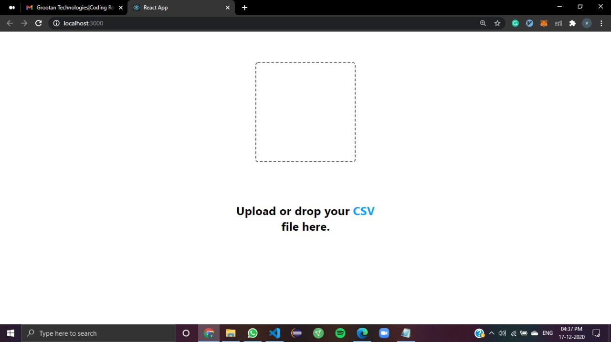
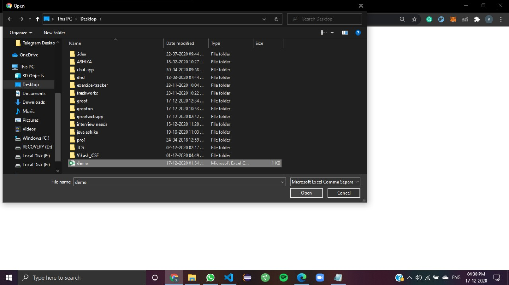
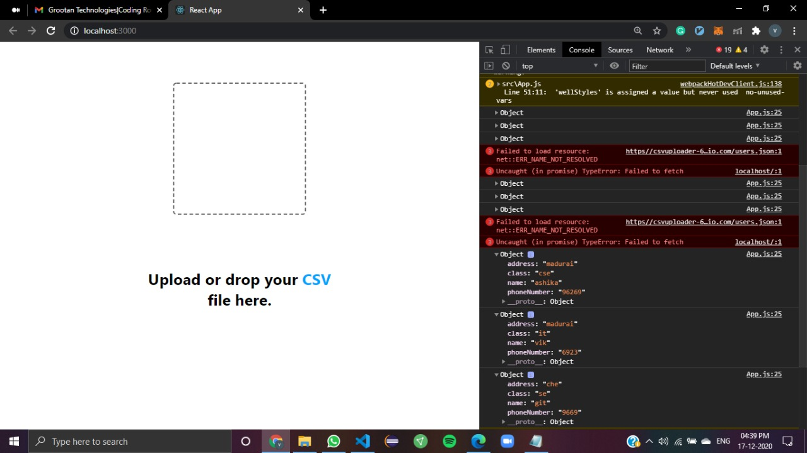

a web application with an option to upload a CSV file of 1 lakh or more records,
where the application should read the records, process it, and push to the database table

front-end (React) 
react-drop-zone is used to upload the .csv file (https://www.npmjs.com/package/react-drop-zone)
csv is used as a parser converting CSV text into arrays or objects.(https://www.npmjs.com/package/csv)
click on box

select a .csv file

the cvs is parsed to objects which can be seen in console

